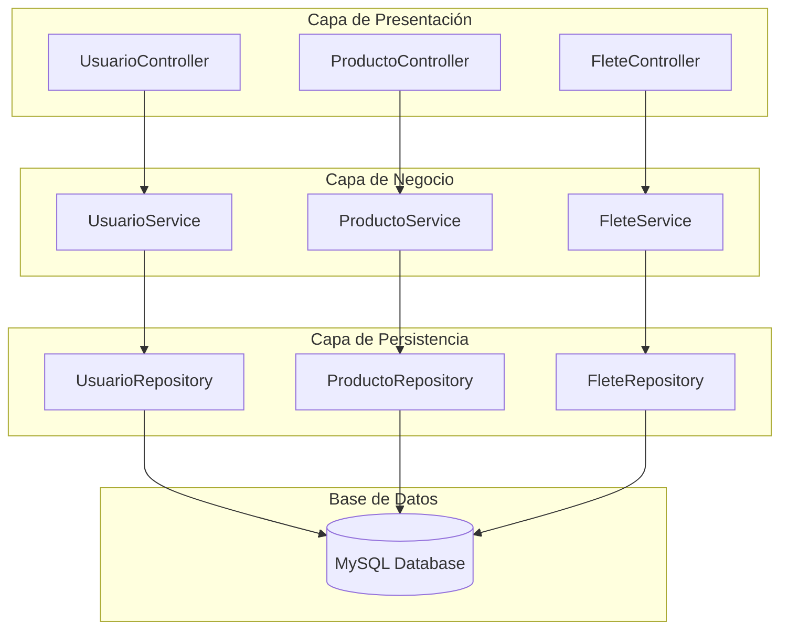

# Diagrama de Componentes — AgroValle Connect

Muestra la organización estructural y la modularización de los componentes de software en el backend.

## Diagrama

```mermaid
graph TD
    subgraph "Capa de Presentación"
        UC[UsuarioController]
        PC[ProductoController]
        FC[FleteController]
    end

    subgraph "Capa de Negocio"
        US[UsuarioService]
        PS[ProductoService]
        FS[FleteService]
    end

    subgraph "Capa de Persistencia"
        UR[UsuarioRepository]
        PR[ProductoRepository]
        FR[FleteRepository]
    end

    subgraph "Base de Datos"
        DB[(MySQL Database)]
    end

    UC --> US
    PC --> PS
    FC --> FS
    US --> UR
    PS --> PR
    FS --> FR
    UR --> DB
    PR --> DB
    FR --> DB
```
