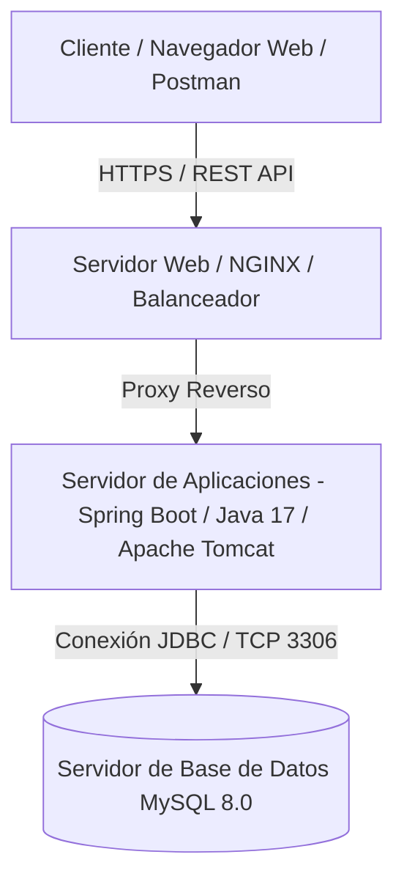

# Diagrama de Despliegue — AgroValle Connect

Ilustra la infraestructura física y lógica donde se ejecuta la aplicación en un entorno de producción o pruebas.

## Diagrama

```mermaid
graph TD
    Client[Cliente / Navegador Web / Postman] -->|HTTPS / REST API| LB[Servidor Web / NGINX / Balanceador]
    LB -->|Proxy Reverso| AppServer[Servidor de Aplicaciones - Spring Boot / Java 17 / Apache Tomcat]
    AppServer -->|Conexión JDBC / TCP 3306| DBServer[(Servidor de Base de Datos MySQL 8.0)]
```
