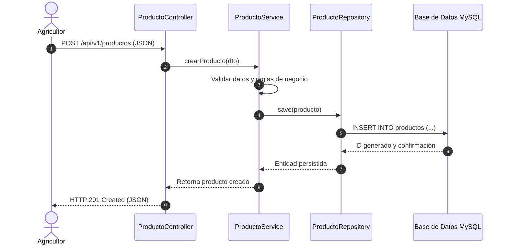

markdown
# Diagrama de Secuencia — AgroValle Connect

Representa el flujo de tiempo y la interacción entre los componentes al registrar una cosecha en el sistema (HU-02).

## Diagrama

```mermaid
sequenceDiagram
    autonumber
    actor Agricultor
    participant Controller as ProductoController
    participant Service as ProductoService
    participant Repo as ProductoRepository
    participant DB as Base de Datos MySQL

    Agricultor->>Controller: POST /api/v1/productos (JSON)
    Controller->>Service: crearProducto(dto)
    Service->>Service: Validar datos y reglas de negocio
    Service->>Repo: save(producto)
    Repo->>DB: INSERT INTO productos (...)
    DB-->>Repo: ID generado y confirmación
    Repo-->>Service: Entidad persistida
    Service-->>Controller: Retorna producto creado
    Controller-->>Agricultor: HTTP 201 Created (JSON)
```
